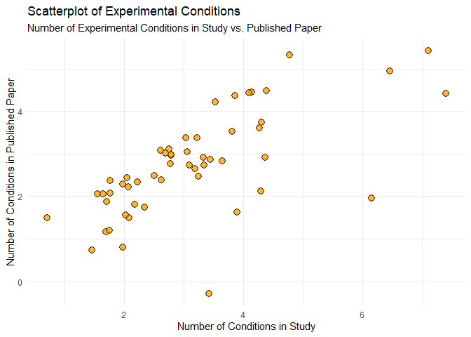

# Publication Bias


## Question 1.

Patterns in `filedrawer.csv` .

``` r
# Loading libraries 
library(tidyverse)
```

    Warning: package 'tidyverse' was built under R version 4.3.3

    Warning: package 'readr' was built under R version 4.3.3

    Warning: package 'forcats' was built under R version 4.3.3

    ── Attaching core tidyverse packages ──────────────────────── tidyverse 2.0.0 ──
    ✔ dplyr     1.1.4     ✔ readr     2.1.5
    ✔ forcats   1.0.0     ✔ stringr   1.5.1
    ✔ ggplot2   3.4.4     ✔ tibble    3.2.1
    ✔ lubridate 1.9.3     ✔ tidyr     1.3.0
    ✔ purrr     1.0.2     
    ── Conflicts ────────────────────────────────────────── tidyverse_conflicts() ──
    ✖ dplyr::filter() masks stats::filter()
    ✖ dplyr::lag()    masks stats::lag()
    ℹ Use the conflicted package (<http://conflicted.r-lib.org/>) to force all conflicts to become errors

``` r
library(modelsummary)
```

    Warning: package 'modelsummary' was built under R version 4.3.3

    `modelsummary` 2.0.0 now uses `tinytable` as its default table-drawing
      backend. Learn more at: https://vincentarelbundock.github.io/tinytable/

    Revert to `kableExtra` for one session:

      options(modelsummary_factory_default = 'kableExtra')
      options(modelsummary_factory_latex = 'kableExtra')
      options(modelsummary_factory_html = 'kableExtra')

    Silence this message forever:

      config_modelsummary(startup_message = FALSE)

**Part a)** Storing the data in a tibble called `filedrawer` using
`read_csv()` .

``` r
# Question 1 Part a)
# Loading Data 
filedrawer <- read_csv("https://ditraglia.com/data/filedrawer.csv")
```

    Rows: 221 Columns: 5
    ── Column specification ────────────────────────────────────────────────────────
    Delimiter: ","
    chr (3): journal, DV, IV
    dbl (2): id, max.h

    ℹ Use `spec()` to retrieve the full column specification for this data.
    ℹ Specify the column types or set `show_col_types = FALSE` to quiet this message.

``` r
filedrawer
```

    # A tibble: 221 × 5
          id journal           DV                 IV     max.h
       <dbl> <chr>             <chr>              <chr>  <dbl>
     1     1 <NA>              Unwritten          Null      12
     2     2 COMMUNICATION     Published, non top Weak       9
     3     3 OTHER             Published, non top Strong    38
     4     4 OTHER             Published, non top Strong     9
     5     5 PSYCHOLOGY        Published, non top Strong     2
     6     6 COMMUNICATION     Published, non top Weak       5
     7     8 <NA>              Unpublished        Weak       4
     8    10 <NA>              Unpublished        Weak      15
     9    11 POLITICAL SCIENCE Published, top     Strong    13
    10    12 <NA>              Unwritten          Weak      31
    # ℹ 211 more rows

**Part b)** Using `datasummary_crosstab()` to count the number of papers
with each publication status.

``` r
# Question 1 Part b)
# Creating count table
datasummary_crosstab(IV ~ DV, data = filedrawer, statistic = ~N)
```

| IV     |     | Published, non top | Published, top | Unpublished | Unwritten |
|--------|-----|--------------------|----------------|-------------|-----------|
| Null   | N   | 5                  | 5              | 7           | 31        |
| Strong | N   | 35                 | 21             | 31          | 4         |
| Weak   | N   | 31                 | 9              | 32          | 10        |

**Part c)** We first organize the data in a way such that we can run the
regression. If a paper is published in a non-top journal or if it is
published in a top journal it is coded to be 1, otherwise 0. Similarly,
if the statistical significance of the main findings is either `Weak` or
`Null` , it is coded to be 1 otherwise 0. We then run a logit regression
using this data.

``` r
# Question 1 Part c)
filedrawer <- filedrawer |>
  filter(DV != "Unwritten") |>  # Filter out rows where DV is "Unwritten"
  mutate(
    published = ifelse(DV %in% c("Published, non top", "Published, top"), 
    1, 0),  # Create binary indicator for published
    significance = ifelse(IV == "Weak" | IV == "Null", 0, 1)  
    # Create binary indicator for significance
  )

# Running the regression
model_1 <- glm(published ~ significance, data = filedrawer,
      family = binomial(link = 'logit'))

# Model summary
modelsummary(list(Significance = model_1), 
             gof_omit = 'Log.Lik|R2 Adj.|AIC|BIC|F', 
             # Omit specified goodness-of-fit statistics
             fmt = 2,  # Format coefficients to 2 decimal places
             stars = TRUE)  # Include significance stars
```

<table style="width:42%;">
<colgroup>
<col style="width: 20%" />
<col style="width: 20%" />
</colgroup>
<thead>
<tr class="header">
<th></th>
<th>Significance</th>
</tr>
</thead>
<tbody>
<tr class="odd">
<td>(Intercept)</td>
<td>0.25</td>
</tr>
<tr class="even">
<td></td>
<td>(0.21)</td>
</tr>
<tr class="odd">
<td>significance</td>
<td>0.34</td>
</tr>
<tr class="even">
<td></td>
<td>(0.31)</td>
</tr>
<tr class="odd">
<td>Num.Obs.</td>
<td>176</td>
</tr>
<tr class="even">
<td>RMSE</td>
<td>0.49</td>
</tr>
</tbody><tfoot>
<tr class="odd">
<td colspan="2"><ul>
<li>p &lt; 0.1, * p &lt; 0.05, <strong> p &lt; 0.01, </strong>* p &lt;
0.001</li>
</ul></td>
</tr>
</tfoot>
&#10;</table>

**Part d)** To account for the possibility that better researchers are
more likely to think up experimental interventions with large treatment
effects and write better papers., we add the `max.h` variable to our
regression.

``` r
# Question 1 Part d) 
model_2 <- glm(published ~ significance + max.h, filedrawer, 
               family = binomial(link = 'logit'))

# Model summary
modelsummary(
  list(Significance = model_1, Significance_ResearchQuality = model_2),  
  # List of models to summarize
  gof_omit = 'Log.Lik|R2 Adj.|AIC|BIC|F',  
  # Omit specified goodness-of-fit statistics
  fmt = 2,  # Format coefficients to 2 decimal places
  stars = TRUE  # Include significance stars
)
```

<table style="width:85%;">
<colgroup>
<col style="width: 20%" />
<col style="width: 20%" />
<col style="width: 43%" />
</colgroup>
<thead>
<tr class="header">
<th></th>
<th>Significance</th>
<th>Significance_ResearchQuality</th>
</tr>
</thead>
<tbody>
<tr class="odd">
<td>(Intercept)</td>
<td>0.25</td>
<td>-0.40</td>
</tr>
<tr class="even">
<td></td>
<td>(0.21)</td>
<td>(0.28)</td>
</tr>
<tr class="odd">
<td>significance</td>
<td>0.34</td>
<td>0.24</td>
</tr>
<tr class="even">
<td></td>
<td>(0.31)</td>
<td>(0.32)</td>
</tr>
<tr class="odd">
<td>max.h</td>
<td></td>
<td>0.04***</td>
</tr>
<tr class="even">
<td></td>
<td></td>
<td>(0.01)</td>
</tr>
<tr class="odd">
<td>Num.Obs.</td>
<td>176</td>
<td>176</td>
</tr>
<tr class="even">
<td>RMSE</td>
<td>0.49</td>
<td>0.47</td>
</tr>
</tbody><tfoot>
<tr class="odd">
<td colspan="3"><ul>
<li>p &lt; 0.1, * p &lt; 0.05, ** p &lt; 0.01, *** p &lt; 0.001</li>
</ul></td>
</tr>
</tfoot>
&#10;</table>

**Part e)** The coefficient for `significance` is not statistically
significant in both models. This suggests that we cannot reject the null
hypothesis that there’s no difference in publication rates (in any
journal) across projects with “Null” and “Weak” results compared to
“Strong” results. Given publication/filedrawer bias, we would have
expected studies with non-significant results to be less likely to be
published but our analysis suggests that this doesn’t appear to be the
case.

The coefficient for `max.h` (representing research quality) is however
statistically significant. So research quality does seem to play a role
in publication.

## Question 2

Patterns in `published.csv` .

**Part a)** Loading data in `published` using `read_csv()` .

``` r
# Question 2 Part a)
# Loading published data
published <- read_csv("https://ditraglia.com/data/published.csv")
```

    Rows: 53 Columns: 5
    ── Column specification ────────────────────────────────────────────────────────
    Delimiter: ","
    dbl (5): id.p, cond.s, out.s, cond.p, out.p

    ℹ Use `spec()` to retrieve the full column specification for this data.
    ℹ Specify the column types or set `show_col_types = FALSE` to quiet this message.

``` r
published
```

    # A tibble: 53 × 5
        id.p cond.s out.s cond.p out.p
       <dbl>  <dbl> <dbl>  <dbl> <dbl>
     1     4      4     4      4     2
     2     8      2    20      2    20
     3    11      4     5      4     2
     4    12      3     5      3     3
     5    22      3    18      3     7
     6    24      2     7      2     2
     7    25      2    10      1     8
     8    30      3    24      3    12
     9    31      2     8      2     6
    10    33      5     9      5     9
    # ℹ 43 more rows

**Part b)** Using `ggplot` a scatterplot is plotted for with `cond.s` on
the x-axis and `cond.p` on the y-axis.

``` r
# Question 2 Part b)
# Create scatterplot
ggplot(published, aes(x = cond.s, y = cond.p)) +  # Define data and aesthetics
  geom_jitter(  # Add jittered points
    width = 0.5, height = 0.5, size = 3, color = "black",
    fill = "orange", shape = 21, stroke = 1, alpha = 0.8
  ) +
  labs(  # Add labels and title
    title = "Scatterplot of Experimental Conditions",
    subtitle = "Number of Experimental Conditions in Study vs. Published Paper",
    x = "Number of Conditions in Study",
    y = "Number of Conditions in Published Paper",
    color = "Conditions in Study"
  ) +
  theme_minimal()  # Apply minimal theme
```



**Part c)** Like in part b), this plots the scatterplot with `out.s` on
the x-axis and `out.p` on the y-axis.

``` r
# Question 2 Part c)
# Create scatterplot
ggplot(published, aes(x = out.s, y = out.p)) +  # Define data and aesthetics
  geom_jitter(  # Add jittered points
    width = 0.5, height = 0.5, size = 3, color = "black",
    fill = "lightblue", shape = 21, stroke = 1, alpha = 0.9
  ) +
  labs(  # Add labels and title
    title = "Scatterplot of Outcome Variables",
    subtitle = "Number of Outcome Variables in Study vs. Published Paper",
    x = "Number of Outcome Variables in Study",
    y = "Number of Outcome Variables in Published Paper",
    color = "Outcome Variables in Study"
  ) +
  theme_minimal()  # Apply minimal theme
```


**Part d)** In both the scatterplots, we observe a upward sloping
positive trend. In the `cond.s` vs `cond.p` , this suggests that studies
with more experimental conditions tend to report more of those
conditions in their published papers. Looking at it the other way
around, the studies that have fewer conditions may thus be less likely
to report them if they didn’t have statistically significant findings.
This could possibly be because of the file drawer bias where researchers
don’t submit projects with statistically insignificant results for
publication and/or because of publication bias where journal editors and
referees are more willing to accept papers with statistically
significant results.

Similarly, the positive trend in the `out.s` vs `out.p` scatterplot
suggests a tendency for selectively reporting those outcome variables
that were found to be statistiscally siginificant or more interesting
while excluding the variables that were not significant or
non-compelling.

## Question 3.

**Part a)** For each study, let $n$ denote the number of tests where
$n = cond.s * out.s$. Now for the significance level, $\alpha = 0.05$,
this represents a 5% chance of incorrectly rejecting the null
hypothesis. So the probability of not rejecting any of the null
hypothesis is given by $(1 - \alpha)^n$. Therefore the probability of
rejecting at least 1 null hypothesis is $1 - (1 - \alpha)^n$.

The below code first calculates the number of tests in each study and
then uses it to calculate the require probability for each study which
is then averaged to give the average (per paper) probability of 0.621.

``` r
# Question 3 Part a) 
alpha <- 0.05  # Significance Level 

published <- published |> 
  mutate(num_tests = cond.s * out.s) |> 
  # Calculate the number of tests for each study
  mutate(prob_reject_at_least_one = 1 - (1 - alpha) ^ num_tests) 
# Calculate the probability of rejecting at least one 
# null hypothesis for each study

average_prob <- mean(published$prob_reject_at_least_one)  
# Calculate the average probability
average_prob
```

    [1] 0.6213821

**Part b)** Following from the previous part, we will be using the
binomial distribution for calculating the necessary probability. First
note that the probability of rejecting at least two null hypotheses is
given by:

$$
1 - P(\text{rejecting 0 null hypothesis}) - P(\text{rejecting 1 null hypothesis})
$$

From the previous part we know that
$P(\text{rejecting 0 null hypothesis}) = (1 - \alpha)^n$. Now we can use
the binomial distribution to calculate the porbability of rejecting
exactly 1 null hypothesis as
$P(\text{rejecting 1 null hypothesis}) = n * \alpha * (1 - \alpha)^{n - 1}$.
Substituing this into the formula above we get the required probability
which is then averaged to get the average (per paper) probability. This
comes out to be 0.34.

``` r
# Question 3 Part b) 
alpha <- 0.05  # Significance Level 

published <- published |>
  mutate(
    prob_reject_zero = (1 - alpha) ^ num_tests,  
    # Probability of rejecting zero null hypotheses
    prob_reject_one = num_tests * alpha * (1 - alpha) ^ (num_tests - 1),  
    # Probability of rejecting exactly one null hypothesis
    prob_reject_at_least_two = 1 - prob_reject_zero - prob_reject_one  
    # Probability of rejecting at least two null hypotheses
  )

# Calculate the average probability of rejecting at least two null hypotheses
average_prob_at_least_two <- mean(published$prob_reject_at_least_two)
average_prob_at_least_two
```

    [1] 0.3401686

**Part c)** The process for this is exactly the same as the previous two
parts. The probability of rejecting at least 3 null hypotheses is given
by:

$$
1 - P(\text{rejecting 0 null hypothesis}) - P(\text{rejecting 1 null hypothesis} - P(\text{rejecting 2 null hypothesis})
$$

We know $P(\text{rejecting 0 null hypothesis})$ and
$P(\text{rejecting 1 null hypothesis})$ from the previous part. The
probability of rejecting exactly 2 null hypothesis is obtained as:
${n \choose 2} * \alpha^2 * (1 - \alpha)^{n-2}$. We can then calculate
the required average (per paper) probability. This comes out to be
0.177.

``` r
# Question 3 Part c) 
published <- published |>
  mutate(
    prob_reject_zero = (1 - alpha) ^ num_tests,  
    # Probability of rejecting zero null hypotheses
    prob_reject_one = num_tests * alpha * (1 - alpha) ^ (num_tests - 1), 
    # Probability of rejecting exactly one null hypothesis
    prob_reject_two = choose(num_tests, 2) * alpha^2 * 
      (1 - alpha) ^ (num_tests - 2),  
    # Probability of rejecting exactly two null hypotheses
    prob_reject_at_least_three = 1 - prob_reject_zero - 
      prob_reject_one - prob_reject_two  
    # Probability of rejecting at least three null hypotheses
  )

# Calculate the average probability of rejecting at 
# least three null hypotheses
average_prob_at_least_three <- mean(published$prob_reject_at_least_three)
average_prob_at_least_three
```

    [1] 0.1775463

**Part d)** From part a), we can conclude that when a researching is
testing multiple conditions within a study, there is a 62.14%
probability that they will find at least one outcome that is
statistically significant purely by chance (at the 5% significance
level). Parts b) and c) show that as the number of tests increases, the
probability of finding statistically significant results by chance also
increases.

This rightly raises concerns about the reliability of findings in
scientific literature. The high probability of rejecting at least one
null hypothesis (62.14%) suggests that within a study more than half of
the time, at least one of the published significant results is due to
chance and not representative of a true effect.
